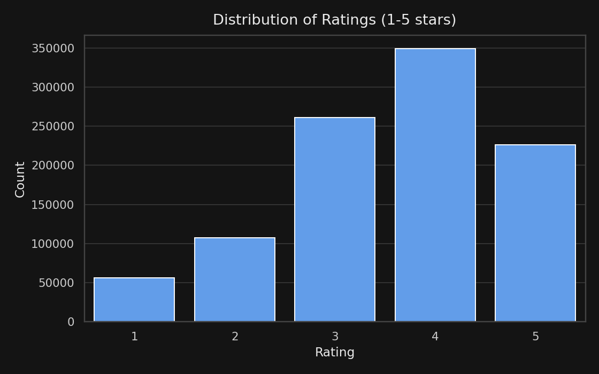
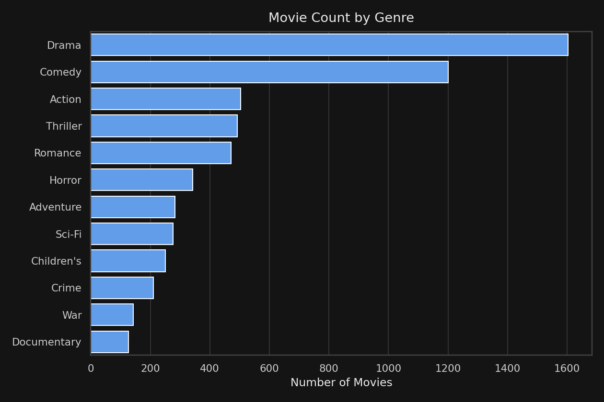
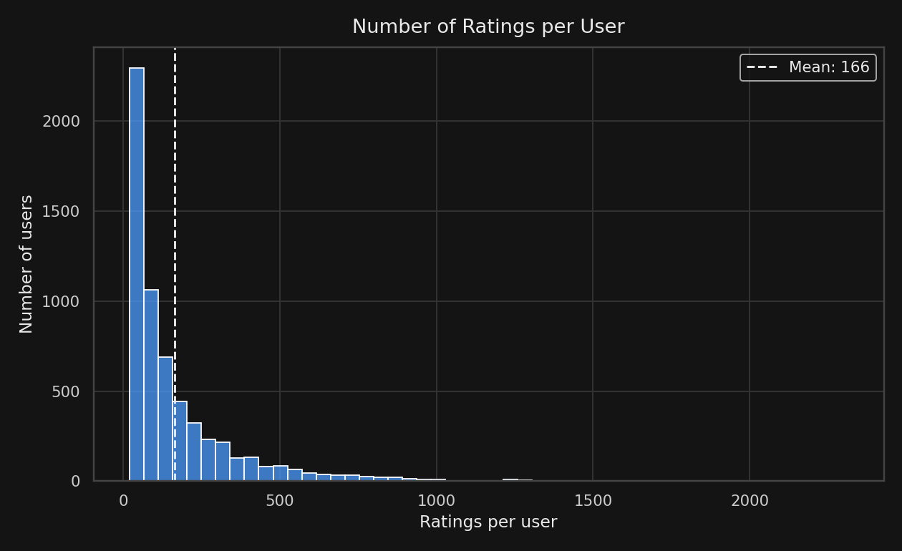
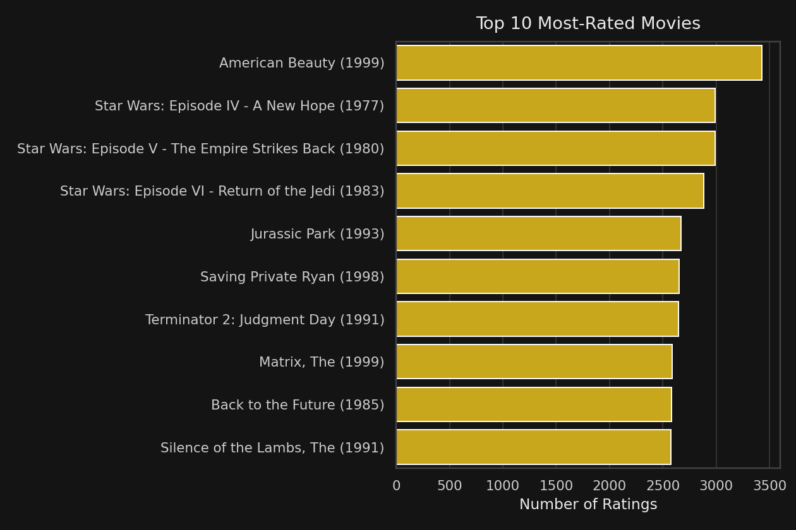

# 🎬 Hybrid Movie Recommendation System

A movie recommender that blends **content-based filtering** (genre similarity) with **collaborative filtering** (rating-pattern similarity via SVD), trained on the MovieLens 1M dataset. Includes a Jupyter notebook walkthrough and an interactive Streamlit app.

[](LICENSE)

## Objective

Build a recommender that doesn't rely on genre tags alone (which can't distinguish a good movie from a bad one in the same genre) or on collaborative filtering alone (which struggles with newer or less-rated titles). Blending both gives recommendations that are relevant in *content* and validated by *real user behavior*.

## Dataset

- **Source:** [MovieLens 1M](https://grouplens.org/datasets/movielens/1m/) (GroupLens Research, University of Minnesota)
- **Size:** 1,000,209 ratings from 6,040 users across 3,883 movies (1919–2000)

## How It Works

| Approach | Technique | Strength |
|---|---|---|
| **Content-based** | TF-IDF over genres + cosine similarity | Works even for movies with few/no ratings |
| **Collaborative** | Item-based similarity on latent factors from Truncated SVD over the sparse user-item ratings matrix | Captures real taste patterns, not just metadata |
| **Hybrid** | Weighted blend of both scores (adjustable) | Best of both — genre-relevant *and* actually liked by similar raters |

## Key Findings



The ratings matrix is **95.7% sparse** — the average user rated only ~166 of 3,883 movies. This is exactly why raw similarity on the ratings matrix doesn't work well, and why dimensionality reduction (SVD) is used instead of a naive item-item comparison.



**Drama, Comedy, and Action** are the most common genres in the catalog.



Most users rate well under 200 movies, with a long tail of highly active raters — typical of real-world implicit engagement data.



**American Beauty (1999)** is the most-rated movie in the dataset, with 3,428 ratings.

Querying the hybrid model for **"Toy Story (1995)"** returns *Toy Story 2*, *A Bug's Life*, *Chicken Run*, *Antz*, and *The Iron Giant* — genuinely sensible sequel/genre-mate recommendations, not just random animated films.

## Repository Structure

```
Movie-Recommendation-System/
├── Movie_Recommender.ipynb   # Full walkthrough notebook (outputs included)
├── app.py                    # Streamlit interactive app
├── recommender.py            # Core HybridRecommender class
├── model.pkl                 # Precomputed model (TF-IDF + SVD factors)
├── movies_clean.csv          # Movie catalog
├── ratings_clean.csv         # User ratings
├── charts/                   # Exported visualizations (embedded above)
├── requirements.txt
├── LICENSE
└── README.md
```

## How to Run

**Notebook:**
```bash
git clone https://github.com/Baji-Shaida/Movie-Recommendation-System.git
cd Movie-Recommendation-System
pip install -r requirements.txt
jupyter notebook Movie_Recommender.ipynb
```

**Streamlit app:**
```bash
streamlit run app.py
```
Then search for a movie, adjust the content-vs-collaborative weighting slider, and get live recommendations.

## Tools & Libraries

- Python, Pandas, NumPy
- scikit-learn (TF-IDF, Truncated SVD, cosine similarity)
- SciPy (sparse matrices)
- Matplotlib & Seaborn
- Streamlit

## Author

**Shaik Baji Shaida** — [LinkedIn](https://www.linkedin.com/in/bajishaida/) | [GitHub](https://github.com/Baji-Shaida)
